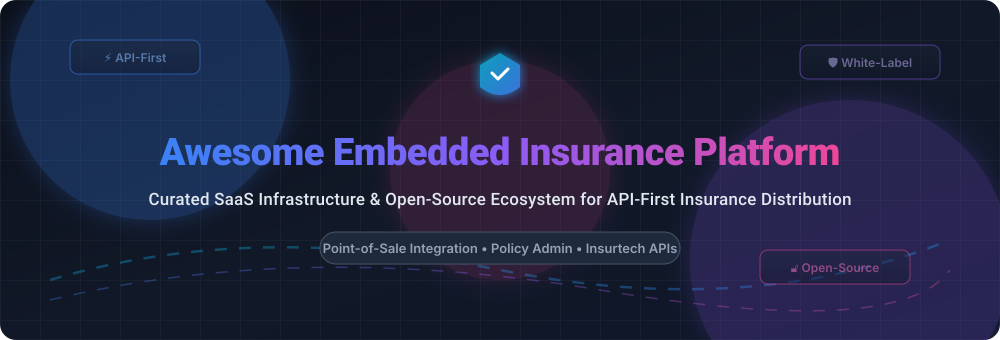

  

      

---

# 🛡️ Awesome Embedded Insurance Platform 🚀

> **A curated list of top SaaS products, Insurtech APIs, and open-source GitHub projects for API-first insurance distribution, point-of-sale coverage, and white-label policy administration.**

Welcome to the definitive guide on **Embedded Insurance Platforms**! Embedded insurance enables digital platforms, e-commerce checkouts, travel OTAs, fintech apps, mobility services, and real estate portals to seamlessly embed insurance protection directly into customer purchase journeys via RESTful APIs and white-label SDKs.

---

## 📑 Table of Contents
- [📊 Sector Market Overview](#-sector-market-overview)
- [💼 Top SaaS & Hosted Platforms](#-top-saas--hosted-platforms)
- [🔓 Open-Source GitHub Projects](#-open-source-github-projects)
- [🛠️ Key Architectural Components](#-key-architectural-components)
- [🤝 Support & Community](#-support--community)
- [📈 Star History](#-star-history)
- [🤝 How to Contribute](#-how-to-contribute)
- [📜 License & Disclaimer](#-license--disclaimer)

---

## 📊 Sector Market Overview

> 🌐 **Market Size & Industry Dynamics**: The global embedded insurance market is estimated at **$156 Billion in 2026** and projected to exceed **$700 Billion by 2030**. The sector is currently **moderately fragmented**, led by B2B2C API providers in travel, mobility, and e-commerce, while specialized MGAs and regional carriers compete across localized regulatory jurisdictions.

---

## 💼 Top SaaS & Hosted Platforms

Below is a curated comparison of leading SaaS and hosted embedded insurance infrastructure providers, **sorted by company size (valuation / revenue) descending**:

| 🏢 Platform | 📝 Category & Description | 💰 Company Size (Valuation / Revenue) | 🏷️ Starting Price | 🎁 Free Tier / Sandbox Limits |
| :--- | :--- | :--- | :--- | :--- |
| **[Cover Genius](https://covergenius.com/)** | ✈️ **Global Distribution API** Processes claims in 7 days with 60%+ auto-adjudication. Partners include Booking.com, eBay, and Ryanair. | **$1.90 Billion Valuation** ($100M+ ARR / $3B+ Cumulative GWP) | **$0.15 / transaction** (Base API integration tier for digital merchants) | **30-Day Staging Sandbox** (Unlimited mock API calls & sandbox policy creation) |
| **[Sure](https://www.sure.com/)** | 🏛️ **MGA-as-a-Service Platform** 50-state US license footprint. Low-code `<SurePolicy />` component & pre-contracted carriers (Chubb, Munich Re). | **$550 Million Valuation** ($100M+ Total Funding) | **$500 / month** (Base SaaS fee + 2.5% GWP distribution fee) | **14-Day Developer Sandbox** (Up to 100 test policy quotes & bind simulations) |
| **[Openly](https://openly.com/)** | 🏠 **Real Estate & Homeowners Carrier** API integration into mortgage closing and real estate workflows for instant property insurance quotes. | **$400 Million Valuation** ($75M Funding Raised) | **$150 / agent per month** (API suite & partner portal access) | **14-Day Demo Environment** (Mock homeowner quote generation & agent sandbox) |
| **[Qover](https://qover.com/)** | 🇪🇺 **Pan-European Orchestration API** Operates across 32 EU/UK countries with built-in GDPR, DORA, and IDD compliance. Partners: Revolut, Deliveroo. | **$350 Million Valuation** ($100M+ Raised) | **€300 / month** (Starter developer API package + active policy fee) | **30-Day API Staging Trial** (Full access to Open API endpoints & test keys) |
| **[INSTANDA](https://instanda.com/)** | ⚙️ **No-Code Core Builder** No-code insurance platform with embedded modules for insurers and MGAs to launch products without IT legacy code. | **$250 Million Valuation** ($45M Series B / $25M+ ARR) | **$1,000 / month** (Starter core builder license for MGAs) | **30-Day Free Trial** (1 test tenant sandbox with 5 developer seats) |
| **[Boost Insurance](https://boostinsurance.com/)** | 🔌 **Infrastructure API (IaaS)** Compliance, capital, and API-first policy infrastructure for fintechs and digital brands to offer coverage. | **$80 Million Valuation** ($37M Total Funding Raised) | **$250 / month** (Infrastructure API base tier + GWP percentage share) | **30-Day Sandbox Access** (Full access to staging REST APIs & webhooks) |
| **[Wrisk](https://wrisk.com/)** | 🚗 **Automotive Mobility Embedded Insurance** White-label insurance platform integrated directly into vehicle purchase and connected car ownership journeys. | **$50 Million Valuation** (£10M+ Raised; Partners: BMW, RAC) | **£400 / month** (Mobility API starter integration for auto dealers) | **14-Day Staging Access** (Up to 50 test policy binds & VIN lookup calls) |
| **[Companjon](https://companjon.com/)** | ⚡ **Parametric & Micro-Protection API** Dublin-based specialist offering instant parametric compensation for flight delays, trip cancelations, & electronics. | **$35 Million Valuation** (Fintech Protection Specialist) | **€200 / month** (Developer platform starter fee for purchase protection) | **30-Day Sandbox Trial** (Test suite for instant parametric claims & quotes) |
| **[Setoo](https://setoo.co/)** | ⏱️ **Parametric Micro-Duration Coverage** Platform enabling e-commerce & travel platforms to offer personalized, instant-claim insurance policies. | **$20 Million Valuation** (€10M Raised) | **€150 / month** (Parametric API starter tier + 1% transaction fee) | **14-Day Developer Sandbox** (Up to 250 test parametric flight/delay policies) |
| **[Embedded Insurance Europe](https://embeddedinsurance.eu/)** | 🌐 **EU MGA & Carrier Connector** Connects European MGAs, insurers, and digital distribution partners via unified distribution APIs. | **$10 Million Valuation** (European Ecosystem Connector) | **€100 / month** (Starter connector tier for local European brokers) | **30-Day Free Sandbox** (Full access to test endpoints for EU products) |

---

## 🔓 Open-Source GitHub Projects

The open-source ecosystem provides essential building blocks—from microservices architectures to policy administration frameworks and AI claim agents. Below are top repositories **sorted by GitHub Stars_Count (descending)**:

| 📦 Repository & Link | ⭐ GitHub_Stars | 💻 Tech Stack & Description |
| :--- | :---: | :--- |
| **[asc-lab/dotnetcore-microservices-poc](https://github.com/asc-lab/dotnetcore-microservices-poc)** |  | **C# • .NET Core • Docker • RabbitMQ** Comprehensive reference microservices architecture for building an insurance sales, quote engine, and policy administration system. |
| **[chatopera/insuranceqa-corpus-zh](https://github.com/chatopera/insuranceqa-corpus-zh)** |  | **Python • NLP • Datasets** Open-source insurance QA corpus and conversational AI dataset for training domain-specific insurance chatbots and customer support models. |
| **[openkoda/openkoda](https://github.com/openkoda/openkoda)** |  | **Java 17 • Spring Boot • PostgreSQL** Complete open-source enterprise platform with built-in policy administration, claims management, and embedded insurance modules. |
| **[asc-lab/micronaut-microservices-poc](https://github.com/asc-lab/micronaut-microservices-poc)** |  | **Java • Micronaut • Kafka** High-performance Java microservices reference implementation for insurance policy issuance, customer billing, and risk calculation. |
| **[OasisLMF/OasisLMF](https://github.com/OasisLMF/OasisLMF)** |  | **Python • C++ • Actuarial Science** Catastrophe loss modeling framework for the global reinsurance and insurance industry. Simulates environmental risks and financial losses. |
| **[kennethleungty/Finance-LLMs](https://github.com/kennethleungty/Finance-LLMs)** |  | **Python • LangChain • AI Agents** Curated compilation of financial & insurance LLM use-cases, automated underwriting agents, and retrieval-augmented generation pipelines. |
| **[Rishabh42/HealthCare-Insurance-Ethereum](https://github.com/Rishabh42/HealthCare-Insurance-Ethereum)** |  | **Solidity • Web3 • Ethereum** Decentralized healthcare insurance claim approval system utilizing multi-signature smart contracts to grant claims transparently. |
| **[genedan/actuarial-foss](https://github.com/genedan/actuarial-foss)** |  | **R • Python • Julia** Comprehensive collection of open-source actuarial software, life table generators, and loss distribution packages for pricing risk. |
| **[samarailly51-pixel/claimpilot-harness](https://github.com/samarailly51-pixel/claimpilot-harness)** |  | **Python • PyTest • AI Testing** Open testing harness and evaluation framework for automated AI insurance claim processing agents prior to production deployment. |
| **[riskine/ontology](https://github.com/riskine/ontology)** |  | **JSON-LD • RDF • OWL** Global Insurance Ontology standardizing insurance data structures, policy terms, and API payloads across carriers and distributors. |

---

## 🛠️ Key Architectural Components

When engineering a custom embedded insurance distribution platform, teams typically combine:
1. **Core Policy Engine**: Policy creation, lifecycle hooks, and premium calculations (e.g. **Openkoda** or **asc-lab POC**).
2. **AI & Claim Processing**: Automated risk assessment and policy QA (e.g. **Finance-LLMs** or **ClaimPilot**).
3. **Data Standards & Interoperability**: Schema mapping using **Global Insurance Ontology**.
4. **API Integration Layer**: REST/GraphQL endpoints delivering real-time quotes, binds, and digital certificates at point of checkout.

---

## 🤝 Support & Community

Thank you for visiting **Awesome Embedded Insurance Platform**! 💖 

If you find this repository helpful for your insurtech projects, research, or platform integrations, please consider supporting us:
- ⭐ **Star this repository** to help others discover it.
- 🍴 **Fork it** to add new platforms or open-source projects.
- 📢 **Share it** with your colleagues, insurtech builders, and product teams!

☕ **Buy Me a Coffee / Sponsor**:
If you'd like to support ongoing updates and maintenance of this list, you can sponsor the project directly:

---

## 📈 Star History

---

## 🤝 How to Contribute

Contributions are warmly welcomed! 

1. **Fork** the repository.
2. Add your SaaS product or open-source project to `README.md`.
3. Ensure entries include clear descriptions, verified company metrics, pricing, and exact Stars_Badges.
4. Submit a **Pull Request** with a brief summary of the addition.

Please check out our list of awesome resources at [Awesome-Awesome-Awesome](https://github.com/ishandutta2007/Awesome-Awesome-Awesome).

---

## 📜 License & Disclaimer

- **License**: MIT License - see [LICENSE](LICENSE) for details.
- **Disclaimer**: This is a community-curated list intended for informational purposes. Embedded insurance products handle sensitive financial and personal data; always ensure compliance with regional insurance regulations (IDD, state licensing, NAIC) and data privacy laws (GDPR, CCPA).
